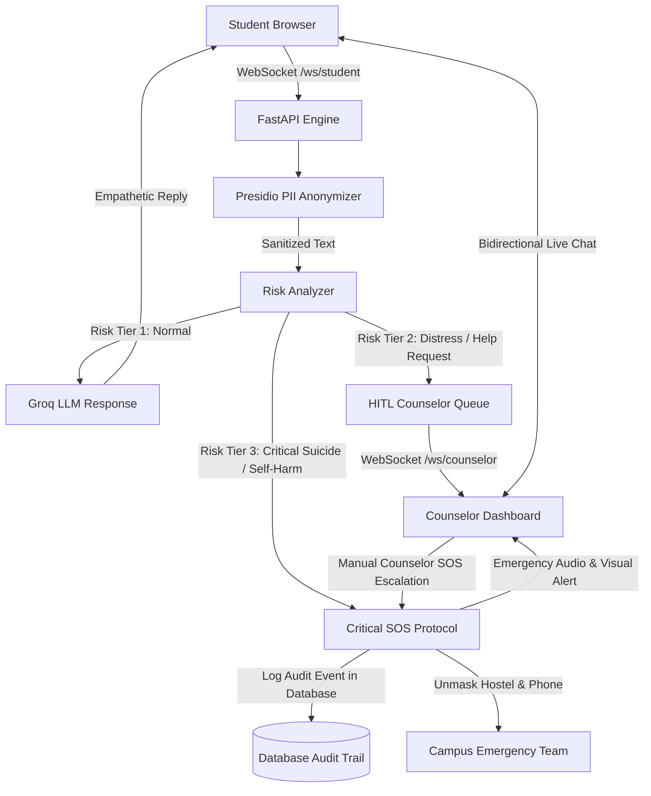

# Mind-Mate: Digital Mental Health Risk Screening System

> **DISCLAIMER:**  
> Mind-Mate is a non-diagnostic triage and screening software tool for university campus environments. It does not give clinical medical diagnoses or psychiatric prescriptions. Licensed human mental health professionals make all final triage and clinical decisions through the Human-in-the-Loop (HITL) console.

---

## 1. Project Overview

Mind-Mate is a real-time mental health risk screening and triage system. It helps university students discuss academic stress, anxiety, and emotional difficulties in a safe and confidential environment.

The software uses a three-tier architecture:
- **Tier 1 (Confidential AI Companion):** Students talk with an empathetic AI agent powered by Groq Large Language Models. A privacy filter removes all personal data before analysis.
- **Tier 2 (Human Counselor Handoff):** When the system detects moderate emotional distress, or when a student requests help, the system transfers the chat to a live campus counselor.
- **Tier 3 (Critical SOS and Campus Dispatch):** When the system detects self-harm or suicide indicators, or when a counselor initiates an emergency escalation from the console, the system triggers an emergency alert. The system displays student location details to campus authorities for immediate physical response. The system stores every SOS escalation event in the database to prevent counselor misuse.

---

## 2. Key Features

### 2.1 Three-Tier Operational Model
- **Tier 1 (AI Companion Mode):**
  - Instant empathetic conversation with students 24 hours a day, 7 days a week.
  - Complete privacy protection. Counselors cannot view Tier 1 conversations.
- **Tier 2 (Live Counselor Workspace):**
  - Real-time counselor dashboard with incoming triage queues.
  - Secure bidirectional messaging through WebSockets.
  - Multi-session workspace to help counselors monitor multiple students simultaneously.
- **Tier 3 (Emergency SOS Protocol):**
  - Deterministic detection of suicide and self-harm keywords.
  - Manual one-click emergency escalation by authorized campus counselors.
  - Audio and visual alerts on counselor consoles.
  - Immutable database audit logging of all SOS actions to prevent counselor misuse.
  - Safe unmasking of student name, phone number, hostel block, and room number for rapid emergency dispatch.

### 2.2 Presidio Privacy Shield (PII Anonymization)
- Removes Personally Identifiable Information (PII) before LLM processing.
- Replaces sensitive text tokens with asterisks (`*****`).
- Recognizes standard and campus-specific data:
  - Student names (large dictionary of names).
  - Alphanumeric university registration numbers (e.g., `21BCE1001`, `24BCE13121`).
  - Standalone numeric roll numbers (8 to 10 digits).
  - Campus hostel blocks (e.g., `BH-1`, `Block 3`, `Girls Hostel`).
  - Hostel room numbers (e.g., `Room 405`, `room number 48`).
  - 10-digit phone numbers.
  - Email addresses and social media handles (`@username`).

### 2.3 Resilient AI Pipeline
- Uses Groq Cloud high-speed inference (free developer tier).
- Configurable via `GROQ_MODEL` in `.env` (default: `openai/gpt-oss-20b`, with candidate fallbacks to `openai/gpt-oss-120b` and `qwen/qwen3.8-27b`).
- Structured JSON output enforcement (`bot_reply` and `risk_tier`).
- Offline safety regex analyzer acts as an emergency safety net if external API connections fail.

### 2.4 Built-In Crisis Directory
- Quick access to verified emergency helplines on all screens:
  - **Tele-MANAS (Government of India):** 14416 / 1800-891-4416 (24x7, Toll-Free)
  - **KIRAN Mental Health Helpline:** 1800-599-0019 (24x7, Toll-Free)
  - **NIMHANS Psychosocial Support:** 080-46110007
  - **Campus Health and Wellness Clinic:** 7560350913
  - **Campus Security Dispatch:** 7024240878

---

## 3. System Architecture



### 3.1 Session Lifecycle States

| State | Description | Who Can Access |
| :--- | :--- | :--- |
| `LIVE_BOT` | Student chats confidentially with AI companion. | Student only (Counselor access forbidden) |
| `AWAITING_COUNSELOR` | Session is escalated and waits in counselor queue. | Student and Counselors |
| `LIVE_COUNSELOR` | Counselor claims session and conducts live chat. | Student and Assigned Counselor |
| `CRITICAL_SOS` | Emergency detected or counselor initiated; student data unmasked and logged to DB. | Student, Counselor, Emergency Dispatch |

---

## 4. Repository Structure

```
Mind-Mate/
├── backend_api/                 # Backend server package
│   ├── anonymizer.py            # Presidio PII scrub engine with campus patterns
│   ├── auth_routes.py           # Student and counselor authentication APIs
│   ├── connection_manager.py    # WebSocket connection and broadcast router
│   ├── database.py              # SQLite database engine and session maker
│   ├── hitl_routes.py           # Counselor queue, SOS unmask, and resolve APIs
│   ├── main.py                  # Main FastAPI application and WebSocket endpoints
│   ├── models.py                # SQLAlchemy database schema models
│   ├── seed_users.py            # Auto-seed database script for demo accounts
│   └── session_routes.py        # Chat session lifecycle and history APIs
├── hitl_dashboard/              # Frontend web interface (HTML/CSS/JS)
│   ├── counselor_dash.html      # Counselor workspace and triage queue console
│   ├── css/
│   │   └── style.css            # Complete design system and responsive styles
│   ├── index.html               # Main landing portal with dual gateway cards
│   ├── js/
│   │   └── common.js            # Shared helpers, sound synthesizer, and utilities
│   └── student_chat.html        # Student confidential chat interface
├── nlp_engine/                  # NLP and risk classification engine
│   ├── __init__.py              # Package initializer
│   └── risk_analyzer.py         # Groq LLM integration and fallback safety checks
├── .env.example                 # Environment configuration template
├── PROJECT_REPORT.md            # Detailed academic engineering report
├── README.md                    # Project documentation (this document)
├── requirements.txt             # Python package dependencies
├── seed_db.py                   # Standalone database reset and seed utility
└── test_anonymizer.py           # Verification script for PII anonymizer
```

---

## 5. System Requirements

- **Operating System:** Linux, macOS, or Windows 10/11
- **Python Version:** Python 3.10, 3.11, or 3.12
- **Groq API Key:** Free API key from [Groq Console](https://console.groq.com/)
- **Web Browser:** Mozilla Firefox, Google Chrome, Microsoft Edge, or Safari

---

## 6. Installation Procedure

Follow these numbered steps to configure and start Mind-Mate on your computer.

### Step 1: Clone the Repository
Open a terminal and download the project repository:

```bash
git clone https://github.com/divnix28/Mind-Mate.git
cd Mind-Mate
```

### Step 2: Create a Virtual Environment
Create and activate an isolated Python virtual environment:

On Linux or macOS:
```bash
python3 -m venv venv
source venv/bin/activate
```

On Windows:
```cmd
python -m venv venv
venv\Scripts\activate
```

### Step 3: Install Required Dependencies
Install the required Python packages:

```bash
pip install -r requirements.txt
```

### Step 4: Download spaCy Language Model
Download the small English language model required by Microsoft Presidio:

```bash
python -m spacy download en_core_web_sm
```

### Step 5: Configure Environment Variables
Copy the example environment file:

```bash
cp .env.example .env
```

Open `.env` in a text editor and add your configuration:

```env
GROQ_API_KEY="gsk_your_groq_api_key_here"
DATABASE_URL="sqlite:///./mind_mate.db"
HOST="127.0.0.1"
PORT=8000
```

---

## 7. Starting the Application

### Step 1: Start the Server
Run the FastAPI application with Uvicorn:

```bash
uvicorn backend_api.main:app --host 127.0.0.1 --port 8000 --reload
```

The database automatically initializes and seeds demo accounts during startup.

### Step 2: Open the Web Interfaces
Open your web browser and navigate to the following addresses:

| Web Interface | URL | Function |
| :--- | :--- | :--- |
| **Main Landing Portal** | [http://127.0.0.1:8000/](http://127.0.0.1:8000/) | Gateway to student and counselor systems |
| **Student Chat Portal** | [http://127.0.0.1:8000/student_chat.html](http://127.0.0.1:8000/student_chat.html) | Confidential student chat interface |
| **Counselor Dashboard** | [http://127.0.0.1:8000/counselor_dash.html](http://127.0.0.1:8000/counselor_dash.html) | Live triage queue and counselor console |
| **Interactive API Docs** | [http://127.0.0.1:8000/docs](http://127.0.0.1:8000/docs) | Swagger UI for all REST endpoints |

---

## 8. Demo User Accounts

The system automatically initializes pre-configured student and counselor demo accounts in the database during application startup.

Users can sign in with one click by selecting any demo profile card in the interface authentication modals.

---

## 9. API and WebSocket Reference

### 9.1 Authentication Endpoints (`/api/v1/auth`)
- `POST /api/v1/auth/student/register`: Register a new student account.
- `POST /api/v1/auth/student/login`: Authenticate student using email and password.
- `GET /api/v1/auth/students/demo`: List pre-configured demo student profiles.
- `POST /api/v1/auth/counselor/login`: Authenticate counselor using employee ID and password.
- `GET /api/v1/auth/counselors/demo`: List pre-configured demo counselor profiles.

### 9.2 Session Lifecycle Endpoints (`/api/v1/sessions`)
- `POST /api/v1/sessions/start`: Create a new Tier 1 chat session.
- `GET /api/v1/sessions/{session_id}`: Retrieve current session status.
- `GET /api/v1/sessions/{session_id}/history`: Retrieve full chat history for student.
- `POST /api/v1/sessions/{session_id}/escalate`: Student voluntarily requests a counselor.
- `POST /api/v1/sessions/{session_id}/return_to_bot`: Student voluntarily returns to AI companion.

### 9.3 HITL Counselor Endpoints (`/api/v1/hitl`)
- `GET /api/v1/hitl/queue`: Retrieve active escalated sessions (excludes Tier 1 private sessions).
- `GET /api/v1/hitl/session/{session_id}/transcript`: Retrieve anonymized transcript for counselors.
- `GET /api/v1/hitl/sos/details/{session_id}`: Fetch student location details during emergencies.
- `POST /api/v1/hitl/sos/unmask/{session_id}`: Trigger critical SOS campus dispatch event and log to database.
- `POST /api/v1/hitl/sos/close/{session_id}`: De-escalate emergency status to active counselor chat.
- `POST /api/v1/hitl/resolve/{session_id}`: Complete session and return student safely to AI mode.

### 9.4 Real-Time WebSocket Routes
- `ws://127.0.0.1:8000/ws/student/{session_id}`: Bidirectional WebSocket stream for students.
- `ws://127.0.0.1:8000/ws/counselor/{session_id}`: Bidirectional WebSocket stream for counselors.

---

## 10. Verification and Testing

### 10.1 Test PII Anonymization
Run the anonymizer validation test:

```bash
python test_anonymizer.py
```

Expected output:
```
ORIGINAL TEXT : I'm Alex from BH-3 Room 405. Call my mom at +91-9876543210. My ID is 21BCE1001.
SCRUBBED TEXT : I'm ***** from ***** *****. Call my mom at *****. My ID is *****.
```

### 10.2 Test Database Reset
To clear messages and reset chat session 1 to `LIVE_BOT`:

```bash
python seed_db.py
```

---

## 11. Security and Privacy Boundaries

1. **Confidential AI Banter:** Counselors cannot view Tier 1 AI conversations. The server blocks counselor WebSocket and transcript requests with HTTP 403 / close code 1008 while a session is in `LIVE_BOT` status.
2. **Pre-Escalation Scrubbing:** When a session escalates to Tier 2, all student messages are scrubbed of personal identifiers before the counselor views them.
3. **Emergency Unmasking Control:** Student identity and physical room numbers unmask only when the system detects imminent physical danger (Tier 3) or when a counselor clicks the unmask button during an active emergency.
4. **Anti-Misuse Audit Logging:** When an emergency SOS unmasking occurs, the system records the event, session state, and timestamp in the database. This persistent audit record prevents unauthorized counselor misuse.
5. **Credential Protection:** Student and counselor passwords are encrypted using SHA-256 hashing.
